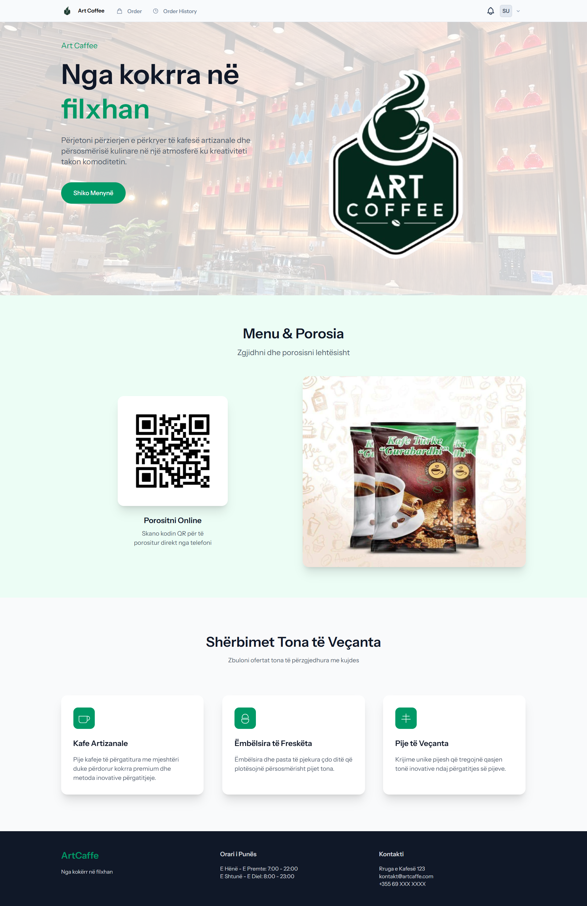
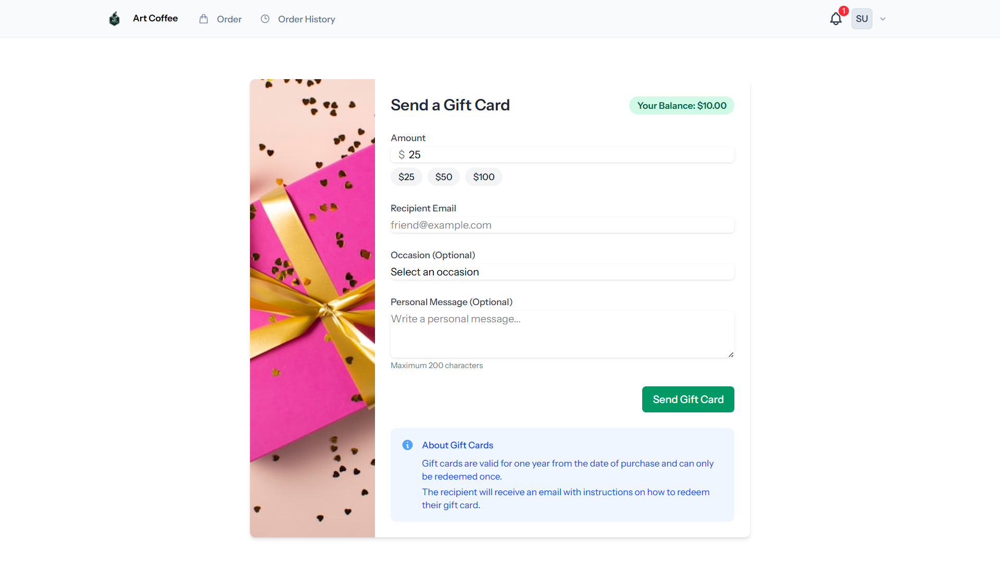
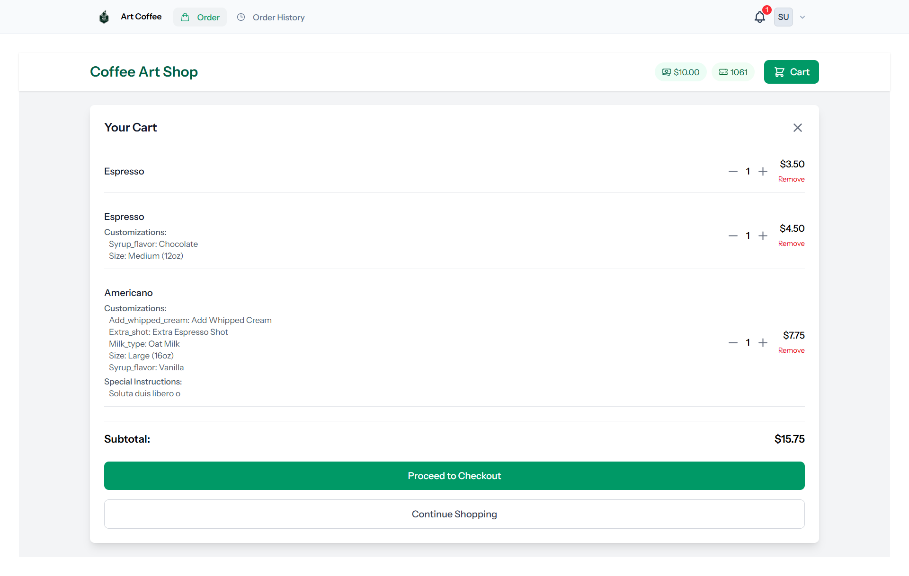
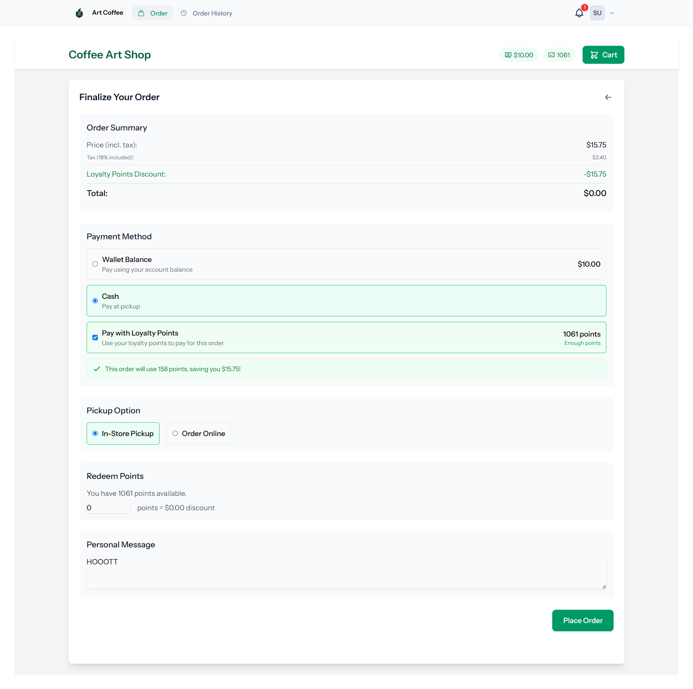
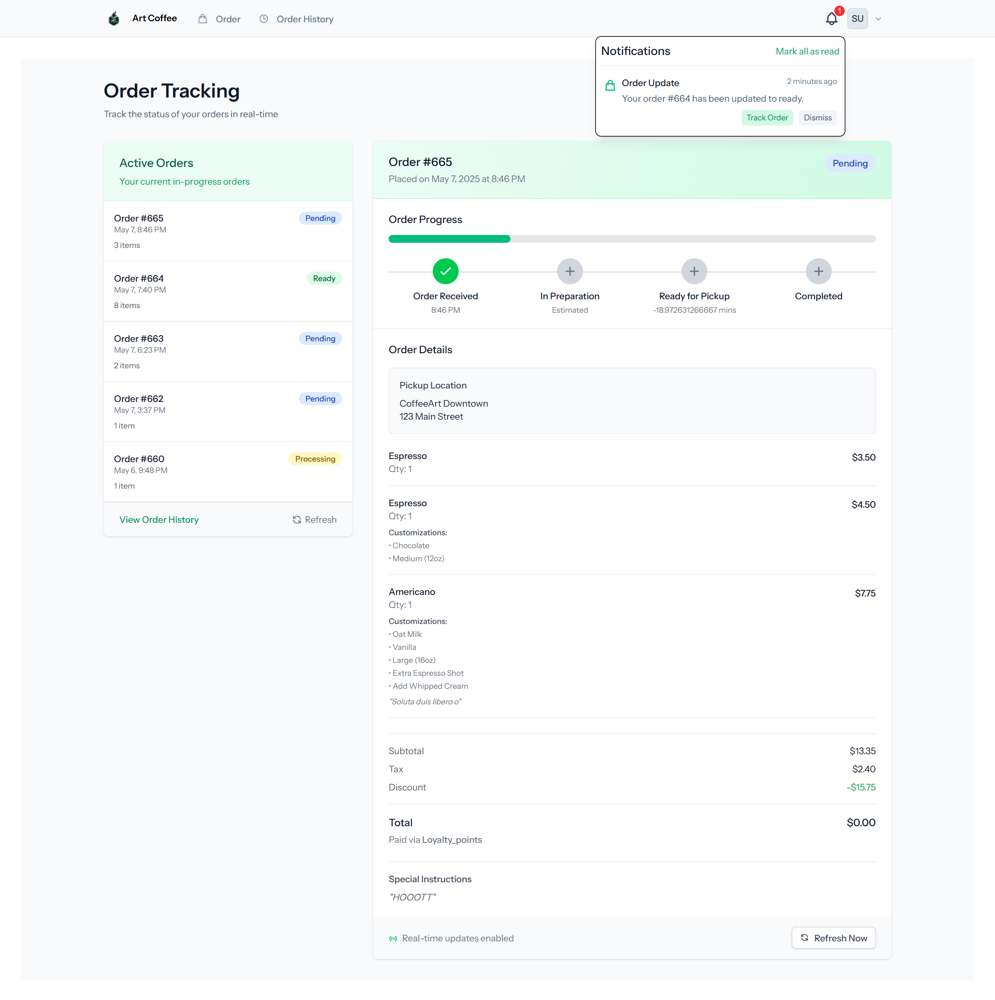
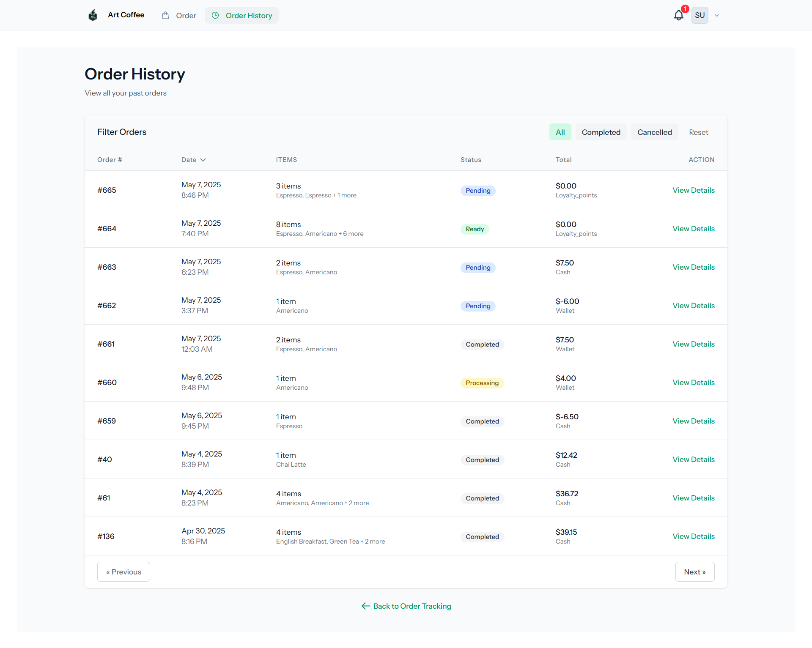
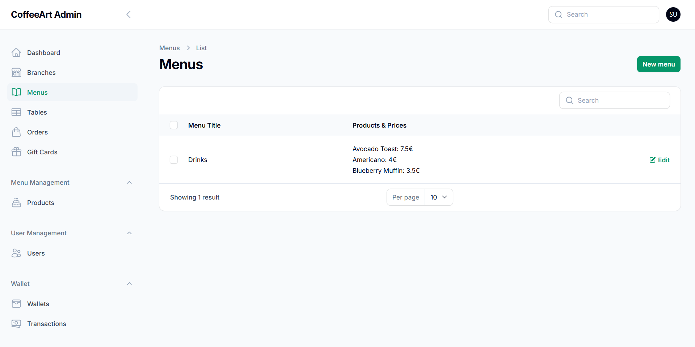
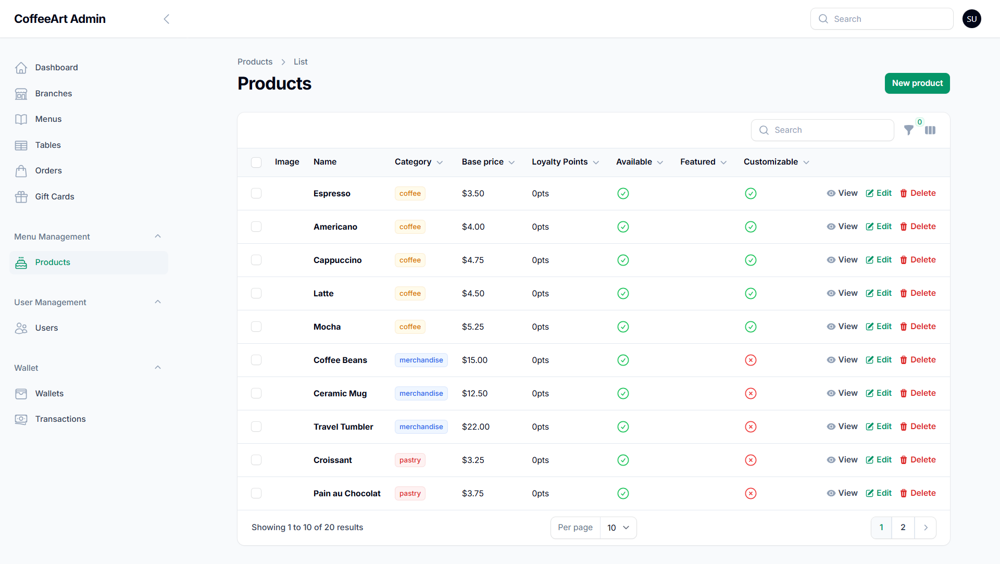
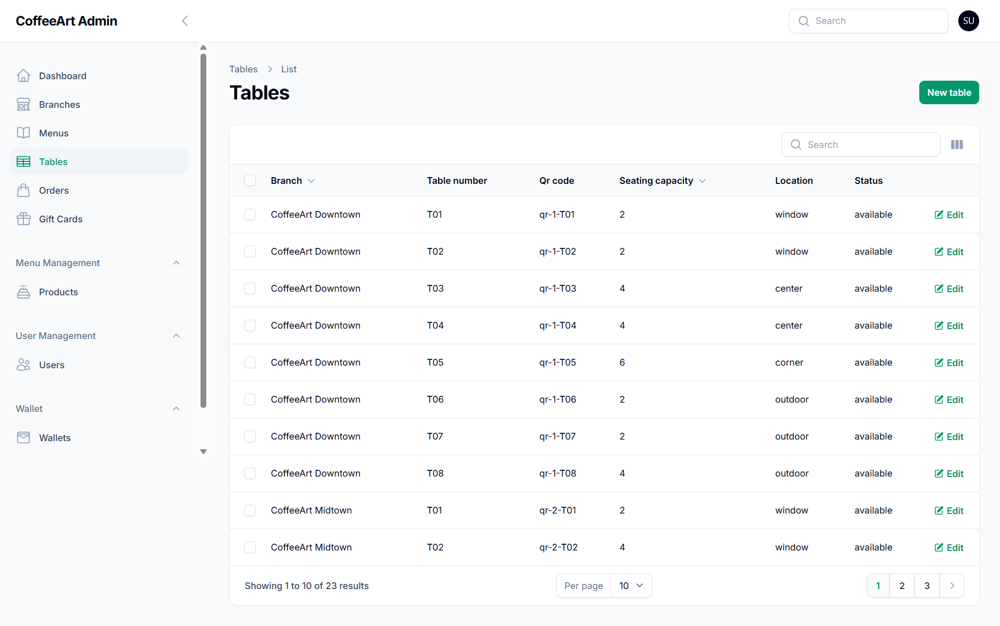
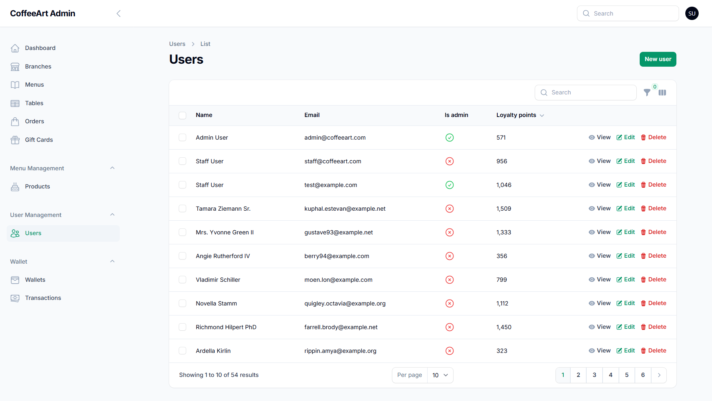

## ☕ Digital Café Companion – All the Juicy Details

We’ve built a smart, modern Café Companion App that reimagines how customers interact with coffee shops. From seamless ordering to real-time updates, every touchpoint is designed for convenience, speed, and personalization.

### 💡 Key Features

#### 🛍️ For Customers

- **Custom Orders**: Fully personalize drinks and food with all available options.
- **Scan & Order at Table**: Instantly order by scanning a QR code at your seat.
- **Loyalty Program**: Earn points on purchases and redeem them for free items.
- **Digital Gift Cards**: Send gift cards with personal messages for special occasions.
- **Real-Time Notifications**: Get instant updates when your order is being prepared or ready.
- **Birthday Surprise**: Users get a **free coffee** notification at **06:00 AM** on their birthday.
- **Advanced Filters**: Easily browse the menu by category, diet, popularity, or caffeine level.
- **Light & Dark Mode**: UI adapts to user preference for accessibility and comfort.

#### 🧑‍💼 For Admins & Staff

- **Admin Dashboard**: Track orders live, manage menus, and oversee loyalty rewards.
- **Product Customization**: Set up custom drink options, stock levels, and availability.
- **Live Order Tracking**: Monitor orders from placement to pickup or delivery in real-time.
- **Background Queue Jobs**: All emails, alerts, and scheduled tasks (e.g., birthday rewards) run in efficient background queues for better performance.

### 🎯 Why It Works

The app’s clean and modern design appeals to every type of customer. Real-time notifications and efficient background processing ensure smooth experiences on both ends — whether you’re sipping a cappuccino or serving one. From loyalty perks to admin control, our Digital Café Companion blends personalization, technology, and great coffee into one powerful tool.

### 📱 Tech Stack

- Laravel
- Livewire
- Tailwind CSS
- Alpine.js
- MySQL

### Screenshots

#### Customer Experience

#### Ordering System

#### Admin Interface

